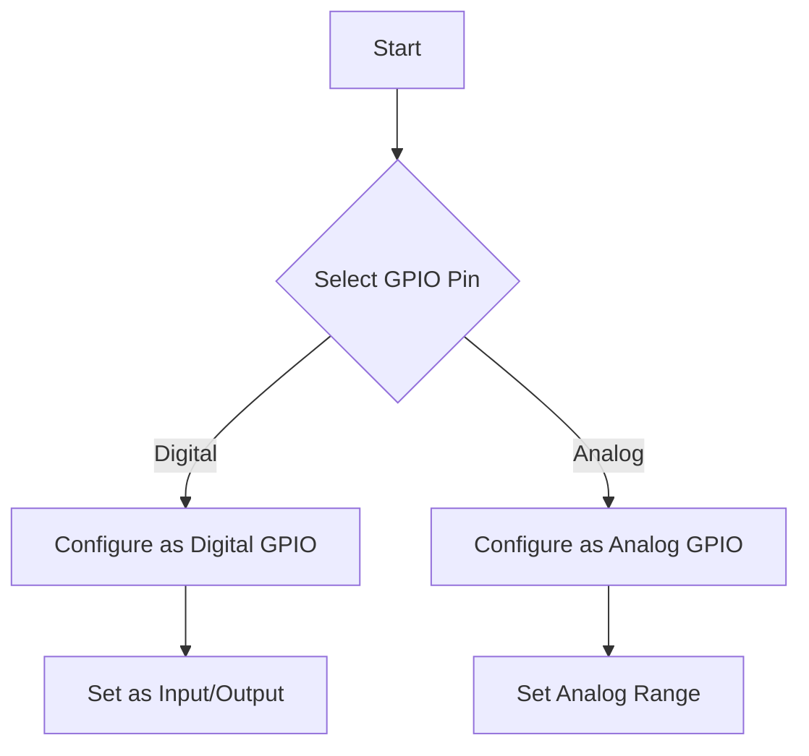
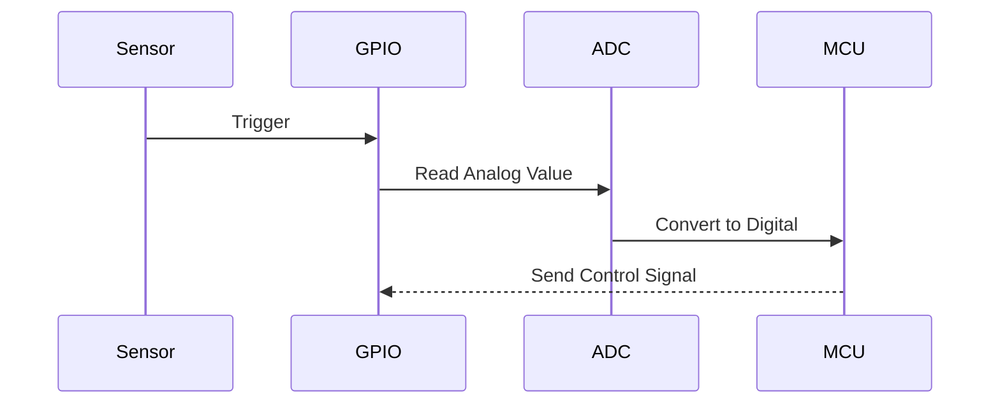
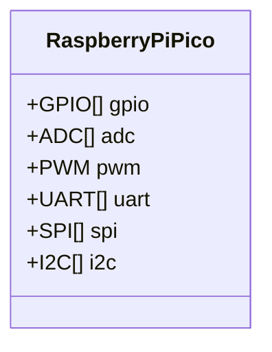
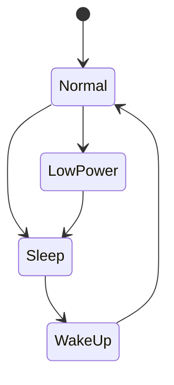
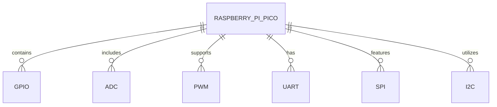
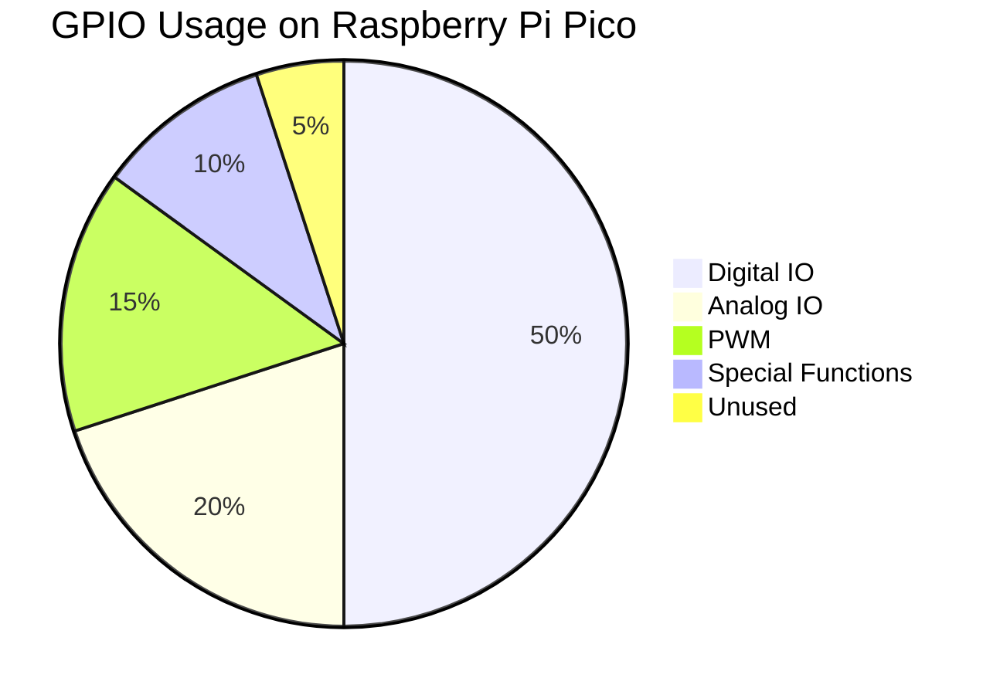
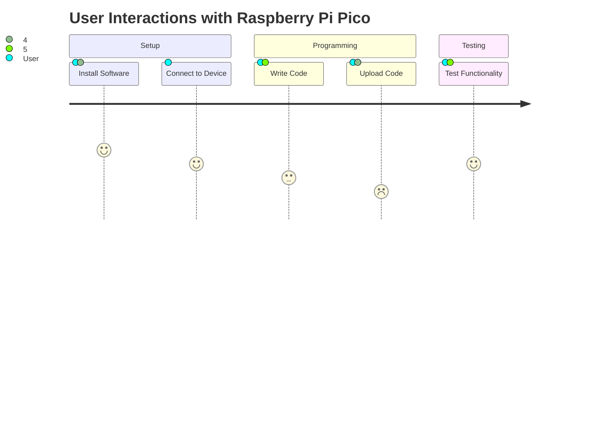

1. Basic Flowchart: GPIO Pin Configuration


2. Sequence Diagram: Data Flow in a Sensor Reading


3. Class Diagram: Raspberry Pi Pico Peripherals


4. State Diagram: Power Management States


5. ER Diagram: Component Relationships


6. Gantt Chart: Project Timeline for Raspberry Pi Pico
```stl
solid cube_corner
  facet normal 0.0 -1.0 0.0
    outer loop
      vertex 0.0 0.0 0.0
      vertex 1.0 0.0 0.0
      vertex 0.0 0.0 1.0
    endloop
  endfacet
  facet normal 0.0 0.0 -1.0
    outer loop
      vertex 0.0 0.0 0.0
      vertex 0.0 1.0 0.0
      vertex 1.0 0.0 0.0
    endloop
  endfacet
  facet normal -1.0 0.0 0.0
    outer loop
      vertex 0.0 0.0 0.0
      vertex 0.0 0.0 1.0
      vertex 0.0 1.0 0.0
    endloop
  endfacet
  facet normal 0.577 0.577 0.577
    outer loop
      vertex 1.0 0.0 0.0
      vertex 0.0 1.0 0.0
      vertex 0.0 0.0 1.0
    endloop
  endfacet
endsolid
```

7. Pie Chart: GPIO Usage Breakdown


8. Journey Map: User Interactions with Raspberry Pi Pico

